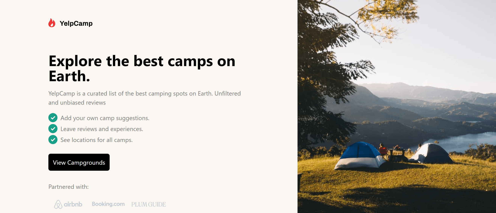
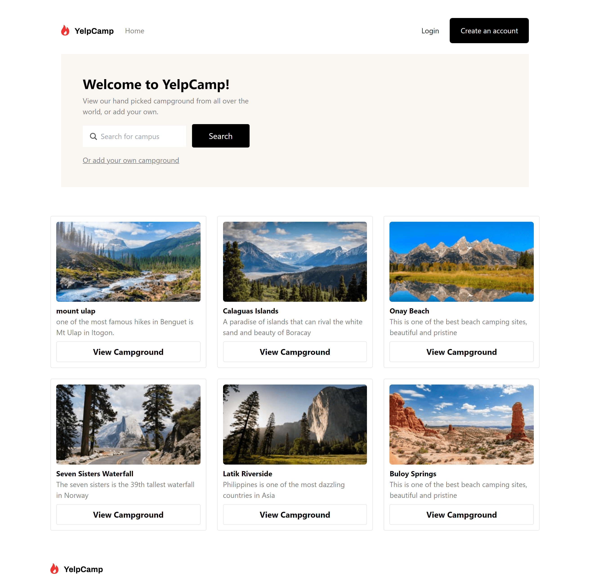
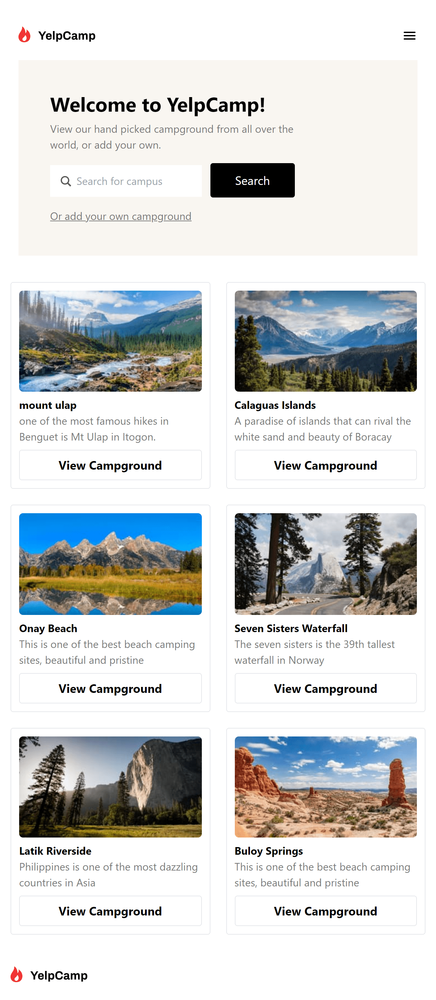
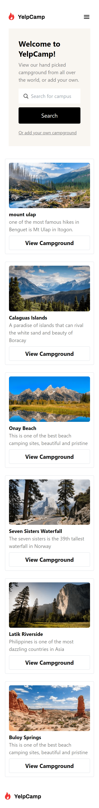
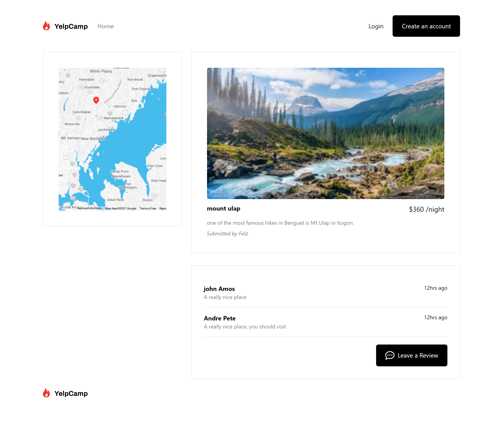
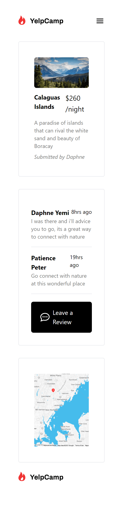

# The yelpcamp team project 

This is a group project involving at least 3 developers.

## Table of contents

- [Overview](#overview)
  - [The challenge](#the-challenge)
  - [Screenshot](#screenshot)
  - [Links](#links)
- [Our process](#our-process)
  - [Built with](#built-with)
  - [What we learned](#what-we-learned)
  - [Useful resources](#useful-resources)
- [Authors](#authors)

## Overview

### The challenge

Users should be able to:

- The first page user sees is the landing page. 
- From the landing page, User should get to the search page and then click on an item on the search page.
- User should be able to view the individual campground page.
- See a success message with their email after successfully submitting the form
- Campground data must not be hardcoded!

### Screenshot
Desktop view of landing page

Tablet view of landing page

Mobile view of landing page

Desktop view of search page

Tablet view of search page

Mobile view of search page

Desktop view of details page

Tablet view of details page

Mobile view of details page

### Links

- Solution URL: [Felicity's repo](https://github.com/felabel/yelpcamp_team_project)
- Solution URL: [Daphne's repo](https://github.com/derhuv/yelpcamp_team_project)
- Solution URL: [Patience's repo](https://github.com/Ndapat/yelpcamp_team_project)

- Live Site URL: [Yelpcamp Team Charlie](https://yelpcamp-team-charlie.vercel.app/)

## Our process

### Built with

- Semantic HTML5 markup
- CSS custom properties
- Javascript
- Mobile-first workflow
- [Tailwindcss](https://tailwindcss.com/)

### What we learned
 
 Here are some of the key learnings that stood out:

 - Collaboration and Communication: Working together as a team of three developers has taught us the importance of effective communication and collaboration. We've learned to leverage each other's strengths and support one another in areas where we needed to grow.

 - Error Handling and Debugging: We've become adept at identifying and resolving errors, which is a crucial skill in any developer's toolkit.

 - Version Control with Git: Our use of Git for version control has become second nature. It's a fundamental skill that we'll carry forward in all our future collaborations.

### Useful resources

- [Tailwind documentation](https://tailwindcss.com/docs/installation) - This helped us learn about different tailwind classes

## Authors

- Website - [Felabel](https://github.com/felabel)
- Website - [Derhuv](https://github.com/derhuv)
- Website - [Ndapat](https://github.com/Ndapat)

